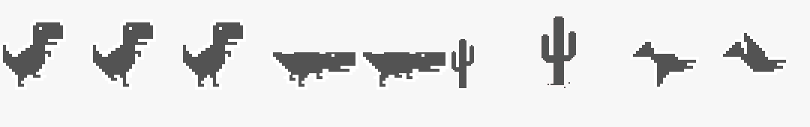

# Dino Runner Band

Play Chromium's T-Rex runner in Claude desktop, in the strip just above the prompt box.
Type `/dino start` and jump over cacti while Claude works.
Built by [Jason Chen (@jasonjias)](https://github.com/jasonjias).



| | |
| --- | --- |
| Plugin | `dino-runner-band` |
| Marketplace (this repo) | `claude-dino-band` |
| Command | `/dino` |
| Works in | Claude desktop app, Code tab. Not the terminal. |

## 1. Install

In a terminal, run these two commands, one at a time:

```sh
claude plugin marketplace add jasonjias/claude-dino-band
```

```sh
claude plugin install dino-runner-band@claude-dino-band
```

Or, inside a Claude Code session, type the same thing as slash commands:

```text
/plugin marketplace add jasonjias/claude-dino-band
```

```text
/plugin install dino-runner-band@claude-dino-band
```

Then **open a new Claude desktop session**. A session that was already open
does not pick up new plugins.

Check it worked: type `/dino` in the prompt box. It should appear in the
command list.

## 2. Play

```text
/dino start
```

The game appears above the prompt box and starts running.

**With the mouse:** click **Jump**, **Duck**, or **Start / Restart** under the game.

**With the keyboard:** first click the gray line under the buttons
("Click here, then: ..."). The game now has the keys:

| Key | Does |
| --- | --- |
| Space, Up, W | Jump. Also starts a new game after game over. |
| Down, S | Duck |
| Enter, R | Start or restart |
| Esc | Give the keys back to the prompt box, so you can type to Claude again |

Avoid cacti and birds. The game speeds up over time, birds show up after
score 200, and day turns to night every 700 points. Your best score is kept.

## 3. Show, hide, and stop the band

The game lives in a band above the prompt box. You control whether it shows:

| You want to | Type | What happens |
| --- | --- | --- |
| Play or restart | `/dino start` | Shows the band and starts a fresh game |
| **Hide it (minimize)** | `/dino off` | Band disappears, run is paused. Prompt area goes back to normal |
| Show it again | `/dino on` | Band comes back. A paused run picks up where it left off |
| Flip shown / hidden | `/dino` | Hides it if shown, shows it if hidden |
| End the run, keep the band | `/dino stop` | Game resets to the start screen. Best score is kept |

`off` keeps your run paused for later. `stop` ends the run but leaves the band
on screen. Neither one uninstalls anything.

## 4. Remove

Just want it out of the way? `/dino off` hides it. To remove it completely:

**Step 1.** In a terminal, run:

```sh
claude plugin uninstall dino-runner-band@claude-dino-band
```

**Step 2 (optional).** Remove this repo from your marketplace list too:

```sh
claude plugin marketplace remove claude-dino-band
```

Inside a Claude session the slash versions work too:
`/plugin uninstall dino-runner-band@claude-dino-band` and
`/plugin marketplace remove claude-dino-band`.

**Step 3.** Close and reopen every open Claude session. A session keeps the
plugin it loaded at startup, so the band can stay on screen until you do.

**Check it is gone:**

```sh
claude plugin list
```

```sh
claude plugin marketplace list
```

Neither should list `dino-runner-band` or `claude-dino-band`, and `/dino`
should be an unknown command in a new session.

If you installed with `--scope project` or `--scope local`, pass the same
`--scope` to the uninstall command. Uninstall deletes the saved best score
unless you add `--keep-data`. A leftover copy in
`~/.claude/plugins/cache/claude-dino-band` is not loaded after uninstall;
delete it if you like.

To reinstall, repeat [Install](#1-install).

## Update

```sh
claude plugin marketplace update claude-dino-band
```

```sh
claude plugin update dino-runner-band@claude-dino-band
```

Then open a new session.

## Troubleshooting

| Problem | Fix |
| --- | --- |
| `/dino` is an unknown command | Open a new session. Then check `claude plugin list` shows `dino-runner-band@claude-dino-band` as enabled |
| `/dino` does something else | Another plugin also uses `/dino`. Uninstall or disable it |
| Nothing shows above the prompt | Use the Claude desktop app, not the terminal. Run `/dino on` in case it is hidden |
| Keys do nothing | Click the gray instruction line first, or use the buttons |
| Can't type to Claude | The game has the keys. Press Esc |
| Unsupported hook errors | Your Claude build lacks the early-access UI API this plugin needs (see Requirements) |

## Requirements

This plugin uses Claude Code's **early-access function hooks and desktop UI API**,
including `AbovePrompt`, `Svg`, and `Client`. Your Claude build must support those
APIs. The API declarations in the development environment were generated by
Claude Code 2.1.286; compatibility with other builds is unverified.

## Privacy

The game code has no network requests, telemetry, credential handling, shell
execution, or access to your conversations or files. It stores game state
(including the best score) through Claude's plugin state API. The keyboard
listener posts only game actions from its focused client to the plugin.
Installing or updating the plugin uses Claude's normal GitHub marketplace flow.

The published source and commit history were reviewed for credentials, personal
email addresses, machine-specific paths, and local backups. The author name and
GitHub profile are public credits; commits use a GitHub noreply address.

## Sprites

The desktop SVG component did not render embedded PNG images in the development
environment. The converter turns opaque pixel runs into ordinary SVG paths,
preserving Chromium's pixel artwork without an embedded image.

To regenerate `hooks/sheet.ts`:

```sh
python3 -m venv .venv
.venv/bin/pip install Pillow
.venv/bin/python tools/sheet_to_svg.py \
  tools/chromium-dino.png tools/dino-boxes.json hooks/sheet.ts
claude plugin validate .
```

The boxes file defines `run1`, `run2`, `jump`, `duck1`, `duck2`, `cactus`,
`cactus2`, `bird1`, and `bird2`. Duck frames are cropped to 25 pixels tall so
the engine can bottom-align them. Keep rendered SVG scenes under the desktop
component's 131,072-character limit.

## Development

```sh
git clone https://github.com/jasonjias/claude-dino-band.git
claude plugin validate ./claude-dino-band/.claude-plugin/plugin.json
claude --plugin-dir ./claude-dino-band
```

The CLI loads the plugin for that session; playing still requires a compatible
desktop surface. Engine-generated SDK types are excluded from the repository.


- `hooks/register.tsx`: physics, collision detection, rendering, buttons, command.
- `hooks/keys.tsx`: focused keyboard input.
- `hooks/sheet.ts`: generated sprite paths.
- `types/index.d.ts`: game state and plugin state declaration.
- `tools/`: original sprite sheet, crop coordinates, converter, attribution.

The plugin is named `dino-runner-band`; the repository and marketplace are
`claude-dino-band`. Versions before 0.2.0 were called `runner-band`, with a
`/runner` command.

## Validation and limitations

`claude plugin validate` passed for the plugin. Sprite crops were visually
checked. Full gameplay, hot reload, keyboard focus, and fresh desktop
installation still need an in-app check. The current collision model uses
inset rectangles rather than Chromium's detailed collision boxes.

## License

Game code: [MIT](LICENSE). Chromium sprite artwork and derived vectors:
[BSD 3-Clause](tools/CHROMIUM-LICENSE). See
[third-party notices](THIRD_PARTY_NOTICES.md).
